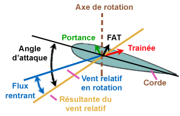
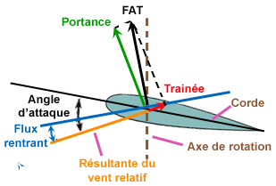
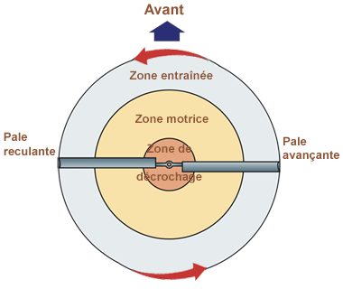
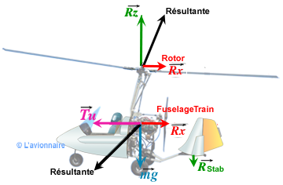
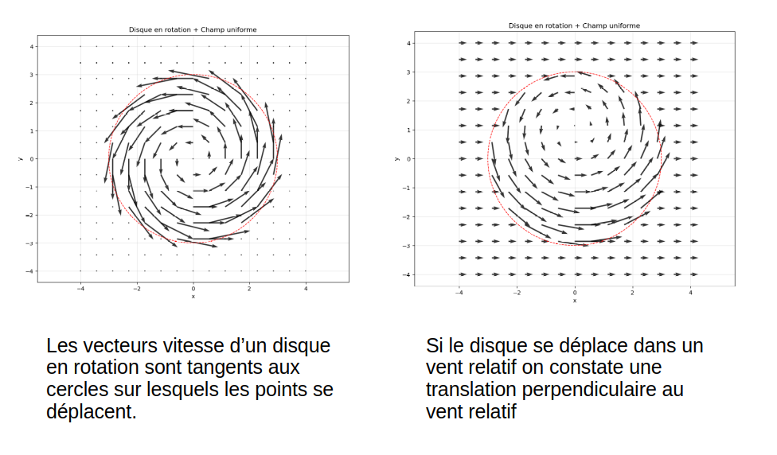
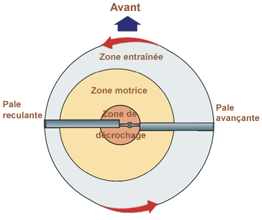
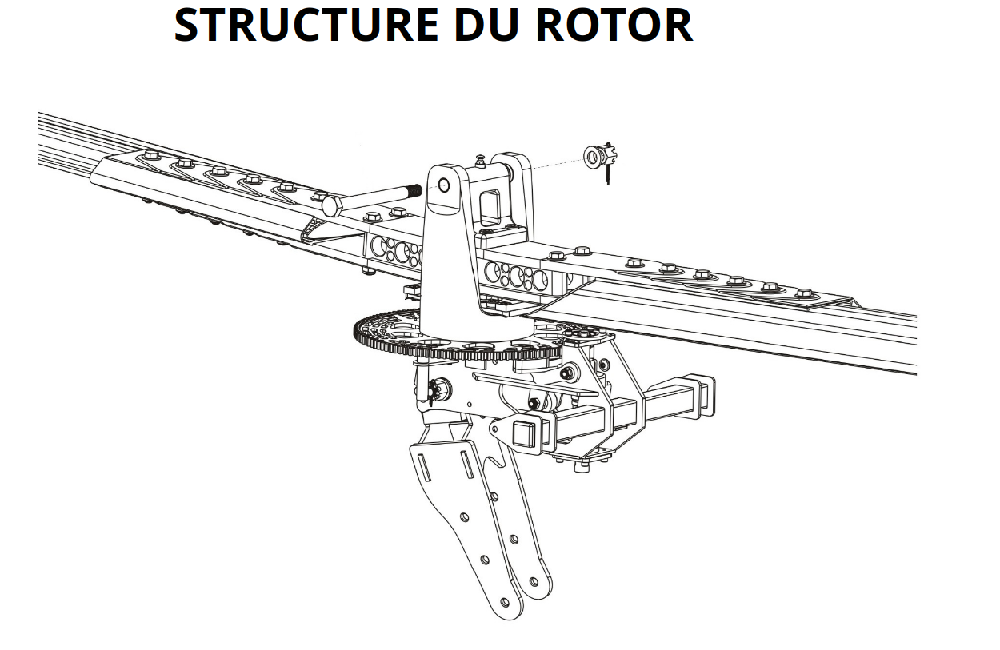

# L'aérodynamique de l'autogire

## Sommaire

- [L'aérodynamique de l'autogire](#laérodynamique-de-lautogire)
  - [Sommaire](#sommaire)
  - [Objectif](#objectif)
  - [Principe de base de mécanique du vol](#principe-de-base-de-mécanique-du-vol)
  - [Principes de base de l'aérodynamique](#principes-de-base-de-laérodynamique)
  - [Aérodynamique spécifique à l'autogire](#aérodynamique-spécifique-à-lautogire)
  - [Les phases de vol](#les-phases-de-vol)
    - [Autorotation verticale](#autorotation-verticale)
    - [Vol en palier stabilisé](#vol-en-palier-stabilisé)
    - [Les pales du rotor](#les-pales-du-rotor)
    - [Phase de décollage](#phase-de-décollage)
  - [Les conséquences pratiques](#les-conséquences-pratiques)
  - [Références](#références)

## Objectif

Ce document vise à expliquer les principes aérodynamiques fondamentaux qui régissent le fonctionnement de l'autogire, de façon à permettre à un élève pilote de comprendre se qui se passe lors de phases caractéristiques du vol.

On étudiera en particulier :

* Le vol en palier stabilisé
* L'autorotation verticale
* La phase de décollage

## Principe de base de mécanique du vol

Un mobile qui suit une trajectoire rectiligne est soumis à un ensemble de forces qui s'équilibrent. Si la somme des forces n'est pas nulle, la trajectoire s'incurve ou le mobile accélère ou décélère.

## Principes de base de l'aérodynamique

Un mobile dans un flux d'air est soumis à des forces aérodynamiques qui dépendent de la forme du mobile, de sa vitesse par rapport à l'air, de la densité de l'air et de la surface projetée perpendiculairement au flux d'air.

R = ½ ρ S Cx V²

où :
* R : force aérodynamique (N)
* ρ : densité de l'air (kg/m³)
* S : surface projetée (m²)
* Cx : coefficient aérodynamique (sans unité)
* V : vitesse relative de l'air (m/s)

Si on étudie une aile, on peut décomposer la force aérodynamique en deux composantes perpendiculaires : la portance (L) et la traînée (D).

Un profil symétrique à incidence nulle ne génère que de la traînée. 

En augmentant l'incidence, on génère de la portance mais aussi plus de traînée.

Ceci jusqu'à une incidence limite où le flux d'air se décolle du profil et où la portance chute brutalement : c'est le décrochage.

## Aérodynamique spécifique à l'autogire

L'autogire est un aéronef à voilure tournante dont le rotor n'est pas motorisé. Le rotor tourne librement sous l'effet du vent relatif créé par le déplacement de l'appareil - c'est le principe de l'**autorotation**.

C'est le même principe que celui qui fait tourner les pales d'une éolienne.

## Les phases de vol

### Autorotation verticale

Lors d'une autorotation verticale, par exemple en cas de panne moteur, l'autogire descend en maintenant le rotor en rotation grâce au flux d'air ascendant. La portance générée par le rotor permet de ralentir la descente et d'assurer un atterrissage contrôlé.

C'est un cas relativement simple puisque le vent relatif sur l'autogire est vertical et que le rotor reçoit un flux d'air régulier.

Sur un point sur une pale, le vent relatif est la somme vectorielle de la vitesse de rotation de la pale et de la vitesse verticale de l'autogire.

Au moyeu de la pale, la vitesse de rotation est nulle, le vent relatif est vertical, l'incidence est très élevée, la pale est en décrochage.

À l'extrémité de la pale, la vitesse de rotation est maximale, le vent relatif est presque horizontal, l'incidence est faible, la pale produit peu de portance.

Au milieu de la pale, l'incidence est optimale, la pale produit de la portance et la résultante aérodynamique est inclinée vers l'avant de l'axe de rotation du rotor, ce qui crée un couple moteur qui maintient la rotation du rotor.

Les différences d'incidence le long de la pale créent trois zones distinctes :
* Zone de décrochage (près du moyeu) : incidence élevée, pale en décrochage, peu de portance.
* Zone motrice (milieu de la pale) : incidence optimale, pale produit de la portance et crée un couple moteur.
* Zone entraînée (près de l'extrémité) : incidence faible, pale produit peu de portance.

### Vol en palier stabilisé

Dans cette phase, l'autogire vole horizontalement à une altitude constante. Le rotor tourne en autorotation grâce au flux d'air généré par la propulsion de l'hélice. La portance produite par le rotor équilibre le poids de l'appareil, tandis que la traction de l'hélice compense la traînée aérodynamique.

- **Portance** : générée par le rotor en autorotation
- **Poids** : force gravitationnelle de l'appareil
- **Traînée** : résistance aérodynamique
- **Traction** : fournie par l'hélice propulsive

Déplacement des zones du rotor en vol horizontal :

On voit donc un décalage des zones du rotor par rapport au vol vertical. La zone motrice se déplace perpendiculairement à la direction du vent relatif.

### Les pales du rotor

Chaque pale du rotor fonctionne comme une aile d'avion en mouvement. La vitesse relative de l'air sur chaque pale varie selon sa position :

- **Pale avançante** : la vitesse de rotation s'ajoute à la vitesse de translation de l'appareil
- **Pale reculante** : la vitesse de rotation se soustrait à la vitesse de translation

Cette variation de vitesse crée une dissymétrie de portance entre les pales avançantes et reculantes. Cela a posé des défis de conception pour les autogires, les premières machines ayant tendance à basculer vers le côté de la pale reculante en raison de la portance réduite de cette dernière.

La solution a été apportée par une tête de rotor articulée qui permet aux pales de monter ou descendre librement, équilibrant ainsi la portance entre les pales avançantes et reculantes.

Le principe est simple : la pale avançante, soumise à une portance plus élevée, monte légèrement, réduisant son incidence et donc sa portance. Inversement, la pale reculante descend légèrement, augmentant son incidence et sa portance.

Globalement cela incline le disque du rotor pour compenser la dissymétrie de portance. Notons que l'inclinaison qui compense la dissymétrie ne serait pas suffisante pour assurer une portance qui équilibrerait le poids. Le rotor est incliné davantage pour générer la portance nécessaire au vol et l'autorotation.

### Phase de décollage

Les conséquences sur la phase de décollage:

Il va falloir atteindre une vitesse suffisante pour que le rotor génère assez de portance pour décoller. Cela se fait en deux phases:

* **Une phase de prélancement** où le rotor est mis en rotation par le moteur à l'aide d'un mécanisme d'embrayage. Le rotor atteint une vitesse de rotation suffisante pour commencer à générer de la portance. La vitesse de pré-lancement dépend du modèle d'autogire elle est de 200 tours/min pour un MTO. 

* **Une phase de course au sol** où l'autogire accélère sur la piste. La vitesse de translation augmente, l'autorotation va accélérer le rotor. Lorsque la portance générée par le rotor équilibre le poids de l'autogire, celui-ci décolle.

Il est primordial de maintenir le manche arrière pendant cette phase. Si l'on essaye de décoller manche avant ou simplement au neutre, l'angle d'attaque du rotor est insuffisant pour générer la portance et on va arriver aux limites des capacités de compenser la dissymétrie de portance avec la tête de rotor articulée. Le rotor va se mettre à vibrer violemment et on risque de perdre le contrôle de l'appareil.

Une fois la roulette avant décollée du sol on va la maintenir à quelques centimètres du sol jusqu'au décollage afin d'éviter de décoller aux grans angles d'incidence. Une fois décollé on maintiendra la machine en palier jusqu'à ce que la vitesse de montée soit atteinte, moment auquel on pourra afficher l'assiette de montée en toute sécurité.

## Les conséquences pratiques

1. L'autogire ne décroche pas en vol normal. Le rotor est toujours en autorotation.

2. En cas de panne moteur, l'autogire peut descendre en autorotation verticale et atterrir en toute sécurité. Le taux de descente en autorotation est comparable à celui d'un parachute. Trop important pour prendre contact avec le sol à cette vitesse verticale. Au environs de 500 ft sol il faudra ré-accélérer l'autogire autour de 110/120 km/h pour intercepter le plan de d'approche et effectuer un atterrissage contrôlé. Le toucher sol se fera à une vitesse verticale très faible grâce à la portance générée par le rotor.

## Références

- [Principes de l'aérodynamique](https://fr.wikipedia.org/wiki/A%C3%A9rodynamique)
- [Fonctionnement de l'autogire](https://fr.wikipedia.org/wiki/Autogire)
- [L'avionnaire, les autogires, mécanique du vol](https://www.lavionnaire.fr/AutogireMecaVol.php)

[Retour au sommaire](../../../README.md)